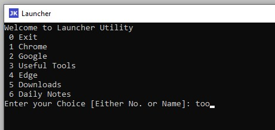

# FAQ

## How to install this tool?

This tool doesn't require any installation. However, it requires you to setup the configuration `LauncherConfig.csv` file

## How to start this tool?

Once the `LauncherConfig.csv` file is updated, Just double click on the .exe file to launch the menu and reap the benefits 😎

✏️ *Pro Tip: Pin this to the task bar to utilize it to full potential*

## Why is `LauncherConfig.csv` file important?

Launcher uses this file to build the custom menu specific to the user.

✏️ *Pro Tip: File should be placed adjacent to the .exe.*

✏️ *Pro Tip: File name should be `LauncherConfig.csv`.*

## What does `LauncherConfig.csv` file contains?

First line of the file is a header containing (Display Name, Path, Argument List). These 3 column names are manadtory, however, they can be in any order. Column names are case insensitive.

### Display Name

This column allows you to have the custom name of the application, file or the location. Launcher will use this name to build the menu.

### Path

This column contains the location of the directory, filename or the application. Launcher will indicate if this path is not valid, thus allowing user to correct this

### Argument List

This column allows you to pass the additional parameter that can be used by the application. For e.g. while launching chrome open the google.com.sg. *This means, you can use this tool as the browser bookmark. Do let me know if you find any more usecase for this tool 😀*

## How to command launcher to open specific item from menu?

As you can notice in the above image, you can either use the number or provide the name to open the sepcific menu item

For e.g. 
to open chrome, I can pass input as `1` or `Chrome` or `chrome` or `ch` or `ome` etc
to open my UsefulTools Repository, I can pass input as `3` or `Tool` or `use` or `useful` etc

Will launch <https://github.com/junaid4812/UsefulTools> in chrome browser

