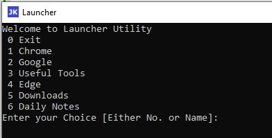

# UsefulTools

Hello Everyone,

My name is Mohammed Junaid Khan, I am a passionate software engineer who likes learning technologies. I love automating the repetative tasks and build some utility tools. These tools work as our assistant performing repetative tasks thus allowing us to explore new technologies or better utilize our time. Hope it helps!! 

If you think of any use case that requires repetative manual efforts, do provide the details under issue section. I'll see if this can be automated.

## Available Tools List

1. [Launcher](#launcher)
2. [PDFUtility](#PDFUtility)

## Launcher

Once you start using this, you'll forget having shortcuts, quick links 🤖

Path: Launcher/LauncherV1.exe

Launcher is a simple tool that organizes all the shortcuts in a single place. These shortcuts include applications/folders/files etc. Menu items on this launcher are fully configurable and can be placed in any order. You will be able to launch/open the menu item either by sl.no or by any matching text or by full name.

Its a simple effort keep your links & application shortcuts handy and to declutter your taskbar/desktop. This tool came in very handy in the below event (I literally had zero impact, while my colleagues were struggling to see on how to start the apps)

On 13th January 2023, Microsoft released a Microsoft Defender signature update that included a change to one of the many Attack Surface Reduction (ASR) rules. This is very common and happens on a regular basis, however in this case there was a bug in the rule that in turn caused Microsoft Defender to start deleting application shortcuts from your desktop, start menu and taskbar.

More information can be found about this here: <https://www.bleepingcomputer.com/news/microsoft/buggy-microsoft-defender-asr-rule-deletes-windows-app-shortcuts/>

## PDFUtility

PDFUtility is a standalone utility tool designed to help with simple operations on PDF files. It can be used to:
* Merge
* Split
* Extract attachments from PDF files

I have personally encountered the need to merge and split PDFs multiple times when applying for Visas, jobs, and background verifications. While there are many online tools available to perform these activities, security was a major concern that prevented me from using them. Documents used for these tasks often contain sensitive information, which is why I created this utility tool. It doesn't require an internet connection or installation, and can perform these tasks with ease

Two versions of the utility are available:

CLI Version: Allows you to create commands and execute multiple operations via a batch file.
GUI Tool: Allows you to enter values and perform the task.

Path:  
PDFUtility/PDFUtility-cli.exe
PDFUtility/PDFUtility-ui.exe
	   
Details on how to use these files is available in the PDFUtility/Readme.md [Yet to be added]